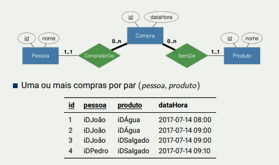
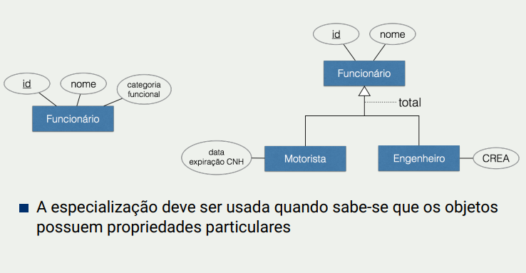

# Segunda aula sobre relacionamentos

O traço grosso significa que a entidade que está **perto** to traço grosso só pode ser identificada com o atributo identificador da entidade vizinha.

Exemplo:

Só o atributo _id_ da entidade Compra não é suficiente para identificar. É necessário tanto o id da Pessoa quanto o id do produto.

# Especialização

A especialização lembra muito o conceito de herança, um exemplo pode ser visto abaixo:

Na forma da esquerda existem problemas. A entidade funcionário teria um atributo CREA que seria nulo no caso de um funcionário motorista, e até poderiam ocorrer problemas de preenchimento.

O _total_ na figura 