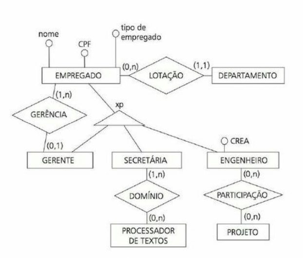
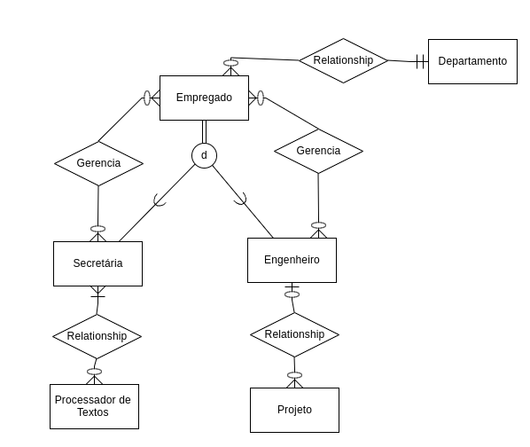

# Exercício 31

De acordo com o DER da Figura 2.38, uma secretária ou um engenheiro não podem ser gerentes. Por quê? Como o DER deveria ser modificado para permitir que tanto uma secretária quanto um engenheiro pudessem ser também gerentes?

O diagrama poderia ser redesenhado da seguinte forma:

