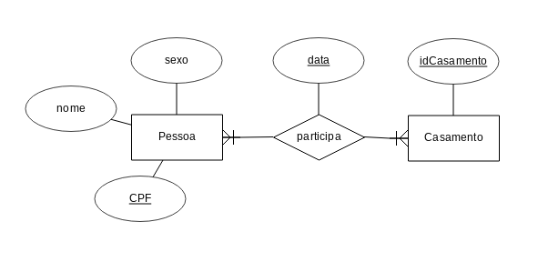

# Seção 2.8 do Heuser (6ª Edição) página 64


## Ex 4.


 Considere o relacionamento CASAMENTO que aparece no DER da Figura 2.7. Segundo este DER o banco de dados poderia conter um casamento em que uma pessoa está casada consigo mesma? O DER permite que a mesma pessoa apareça em dois casamentos diferentes, uma vez como marido e outra vez como esposa? Caso uma destas situações possa ocorrer, como o DER deveria ser modificado para impedi-las?

Figura 2.7 sobre a entidade casamento:


```
O banco de dados mostrado na figura 2.7 possibilita tanto uma pessoa de casar com ela mesma (o ápice do egocentrismo) quanto casar duas vezes, afinal os conjuntos:

(A1,A1) e (A1,A2)

São possíveis de existirem. Para resolver este problema, poderia-se fazer um diagrama ER um pouco diferente:
```


Assim o problema está resolvido, apesar de permitir que mais de duas pessoas participe de um casamento, o que não é o suficiente para os padrões Brasileiros.

Outra forma de fazer é a seguitne:


