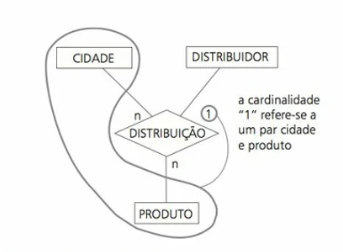
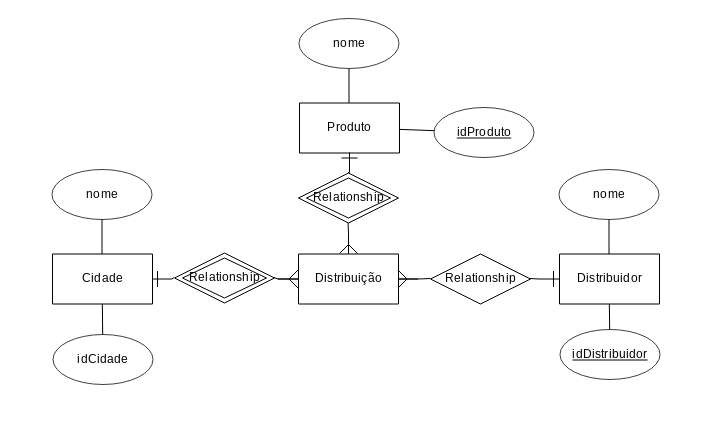

# Exerício 7

Mostre como o modelo ER da Figura 2.11 pode ser represen- tado sem o uso de relacionamentos ternários, apenas com relacionamentos binários.

Figura 2.11:



O relacionamento pode ser melhorado fazendo da seguinte forma:



Desta forma, temos as tuplas:
```
C1,P1,D1
C1,P2,D1
C1,P2,D2 -- Não é permitido, notar cardinalidade
C2,P1,D1
```


