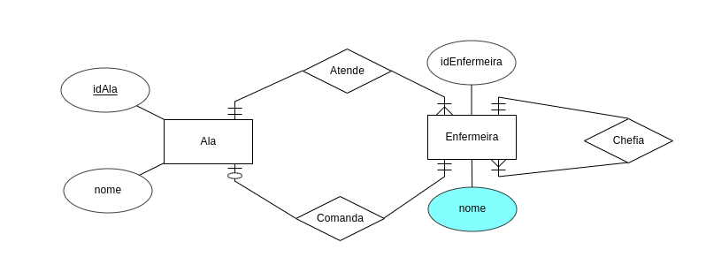
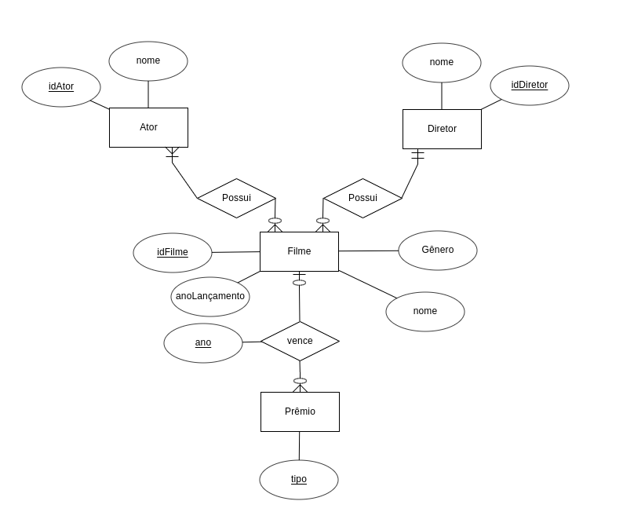
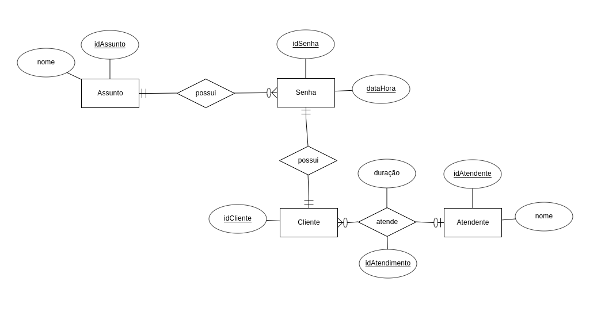
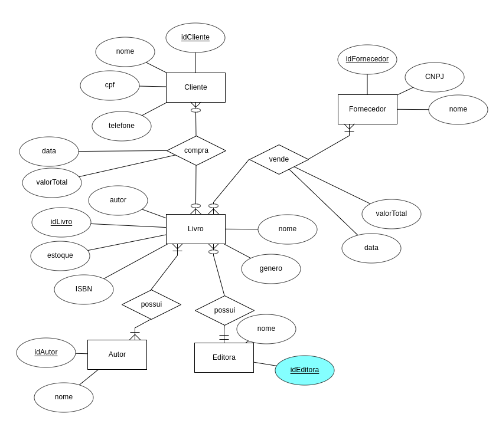
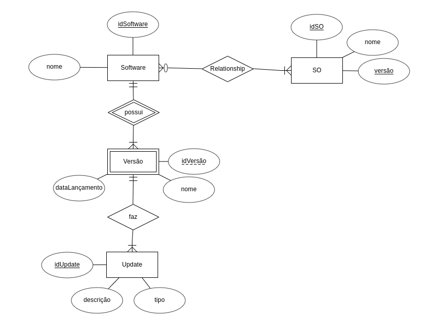
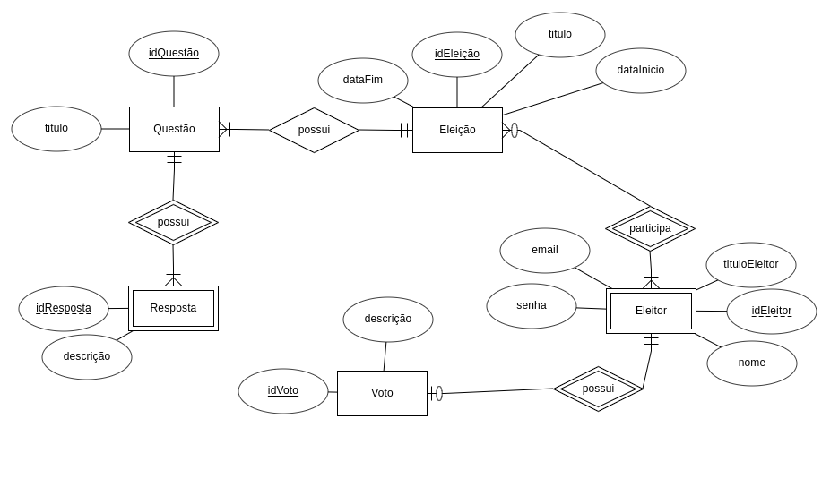
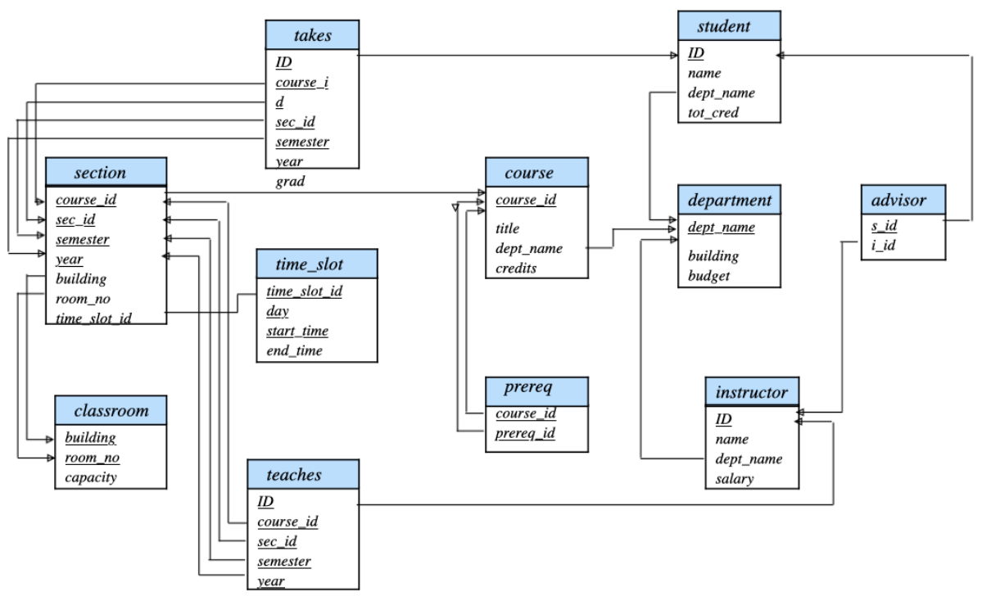

# Lista de exercícios 02 de Banco de Dados | BCD 29008
Semestre: 2022/2
Aluno: Guilherme medeiros

-------------------------------------------

1 . Para cada um dos exercícios da Lista 01, transforme o diagrama ER para o modelo relacional textual simplificado. É necessário que a resposta tenha o diagrama ER e o modelo relacional logo abaixo.

Legenda:

**Negrito**: Chave primária.

_Itálico_: Relação entre chave estrangeira e entidade.

```
Bloco descritivo: Descrição da cardinalidade das entidades.
```


## 1.1.



```S
Relacionamento 1..1 __ 1..n entre Ala e Enfermeira: Adição de coluna
Relacionamento 0..1 __ 1..1 entre Ala e Enfermeira: Fusão de tabela
Relacionamento 1..1 __ 1..n entre Enfermeira e Enfermeira: Adição de coluna
```

### Modelo relacional simplificado:

Ala(**idAla**, nome, idEnfermeiraChefe);

- _idEnfermeiraChefe referencia idEnfermeira em Enfermeira._

Enfermeira(**idEnfermeira**, nome, idAla, idEnfermeiraChefe);

- _idEnfermeiraChefe referencia idEnfermeira em Enfermeira._

-----------------------------------------------

## 1.2



```S
Relacionamento 1..n __ 0..n entre Ator e Filme: Tabela própria
Relacionamento 1..1 __ 0..n entre Diretor e Filme: Adição de coluna
Relacionamento 0..1 __ 0..n entre Filme e Prêmio: Tabela própria
```

### Modelo relacional simplificado:

Ator(**idAtor**, nome)

Diretor(**idDiretor**,nome)

Filme(**idFilme**, anoLançamento, nome, gênero, idDiretor)

- _idDiretor referencia Diretor_

AtorFilme(**idFilme**,**idAtor**)

- _idFilme_ referencia Filme
- _idAtor_ referencia Ator

Premio(**tipo**)

Vencedor(**idFilme**,**idPremio**,**ano**)

- _idFilme_ Referencia Filme
- _Premio_ Referencia Premio

-------------------------------------------------

## 1.3



```S
Relacionamento 1..1 __ 0..n entre Assunto e Senha: Adição de coluna
Relacionamento 1..1 __ 1..1 entre Senha e Cliente: Fusão de tabelas
Relacioanmento 0..n __ 0..1 entre Cliente e Atendente: Adição de coluna
```

### Modelo relacional simplificado:

Assunto(**idAssunto**, nome)

Atendente(**idAtendente**, nome)

Senha(**idSenha**,**dataHora**, idAssunto, idCliente, **idAtendimento**, duracao, idAtendente)

- _idAssunto referencia Assunto_
- _idAtendente referencia Atendente_

-----------------------------------------------------------

## 1.4



```S
Relacionamento 0..n __ 0..n entre Cliente e Livro: Tabela própria
Relacionamento 1..n __ 0..n entre Forencedor e Livro: Tabela própria
Relacionamento 0..n __ 1..1 entre Livro e Editora: Adição de coluna
Relacionamento 1..n __ 1..n entre Livro e Autor: Tabela própria
```

### Modelo relacional simplificado:

Cliente(**idCliente**, nome, cpf, telefone)

Fornecedor(**idFornecedor**, CNPJ, nome)

Editora(**idEditora**, nome)

Livro(**idLivro**, autor, estoque, ISBN, genero, nome, idEditora)

- _idEditora referencia Editora_

VendaForencedorLivro(**idFornecedor**, **idLivro**, data, valorTotal)

- _idFornecedor referencia Fornecedor_
- _idLivro referencia Livro_

CompraClienteLivro(**idCliente**, **idLivro**, data, valorTotal)

- _idCliente referencia Cliente_
- _idLivro referencia Livro_

Autor(**idAutor**, nome)

AutorLivro(**idAutor**, **idLivro**)

- _idAutor referencia Autor_
- _idLivro referencia Livro_

-----------------------------------------------

## 1.5



```S
Relacionamento 1..n __ 0..n entre SO e Software: Tabela Própria
Relacionamento 1..1 __ 1..n entre Software e Versão: Adição de coluna
Relacionamento 1..1 __ 1..n entre Versão e Update: Adição de coluna
```

### Modelo relacional simplificado:

SO(**idSO**, **versao**, nome)

Software(**idSoftware**, nome)

SoftwareSO(**idSoftware**, **idSO**, **versaoSO**)

- _idSoftware referencia software_
- _idSO referencia SO_
- _versaoSO referencia versao em SO_

Versao(**idVersao**, nome, dataLancamento, idSoftware)

- _idSoftware referencia Software_

Update(**idUpdate**, descrição, tipo, idVersao)

- _idVersao referencia Versao_

-----------------------------------------------------------

## 1.6



```S
Relacionamento 1..1 __ 1..n entre Questão e Resposta: Adição de coluna
Relacionamento 1..n __ 1..1 entre Questão e Eleição: Adição de coluna
Relacionamento 0..n __ 1..n entre Eleição e Eleitor: Tabela própria
Relacionamento 1..1 __ 0..1 entre Eleitor e Voto: Fusão de tabelas
```

### Modelo relacional simplificado:

Eleição(**idEleição**, dataFim, titulo, dataInicio)

Questão(**idQuestao**, titulo, **idEleição**)

- _idEleição referencia Eleição_

Resposta(**idResposta**, descrição, **idQuestao**)

- _idQuestao referencia Questão_

Eleitor(**idEleitor**, nome, tituloELeitor, email, senha, idVoto, descrição)

EleitorEleição(**idEleitor**, **idEleição**)

- _idEleitor referencia Eleitor_
- _idEleição referencia Eleição_

---------------------------------------------------------------

## 1.7


```S
Relacionamento 1..1 __ 1..n entre Campus e Departamento: adição de coluna
Relacionamento 1..1 __ 1..n entre Departamento e Curso: adição de coluna
Relacionamento 1..n __ 1..1 entre Curso e Modalidade: adição de coluna
Relacionamento 1..1 __ 1..n entre Departamento e Professor: adição de coluna
Relacionamento 0..n __ 1..n entre Curso e Aluno: Tabela própria
Relacionamento 1..n __ 1..n entre Curso e Disciplina: Tabela própria
Relacionamento 0..n __ 0..n entre Disciplina e Disciplina: Tabela própria
Relacionamento 1..n __ 1..n entre Disciplina e professor: Tabela Própria
Relacionamento 1..1 __ 0..n entre Disciplina e DisciplinaOfer: adição de colunas
Relacionamento 0..1 __ 1..1 entre DisciplinaOfer e EspaçoFísico: Fusão de Tabelas
Relacionamento 1..1 __ 1..n entre DisciçinaOfer e Avaliação: Adição de coluna
Relacionamento 0..1 __ 1..n entre DisciplinaOfer e Professor: Adição de coluna
Relacionamento 1..n __ 1..n entre Avaliação e Aluno: Tabela própria 
Relacionamento 0..n __ 1..1 entre EspaçoFísico e Campus: Adição de coluna
```

### Modelo relacional simplificado:


Campus(**idCampus**, localidade, nome)

Departamento(**idDepartamento**, nome, idCampus)

- _idCampus referencia Campus_

Modalidade(**idModalidade**, nome)

Curso(**idCurso**, nome, cargaHorária, idDepartamento, idModalidade)

- _idDepartamento referencia Departamento_
- _ idModalidade referencia Modalidade_

Aluno(**idAluno**, nome)

AlunoCurso(**idAluno**, **idCurso**, **matricula**)

- _idAluno referencia Aluno_
- _idCurso referencia Curso_

Avaliação(**idAvaliação**, tipo, nome, idDisciOfer)

- _idDisciOfer referencia DisciplinaOfer_

AlunoAvaliação(**idAluno**, **idAvaliação** nota)

- _idAluno referencia Aluno_
- _idAvaliação referencia Avaliação_

Disciplina(**idDisciplina**, sigla, nome, carHoráriaTeo, cargaHoráriaPrat)

DisciplinaPreReq(**idDisciplina**, **idDisciplina**)

- _idDisciplina referencia Disciplina_
- _idDisciplina referencia Disciplina_

DisciplinaCurso(**idDisciplina**, **idCurso**)

- _idDisciplina referencia Disciplina_
- _idCurso referencia Curso_

Professor(**idProfessor**, nome, titulação, áreaFormação, idDepartamento)

- _idDepartamento referencia Departamento_

ProfessorDisciplina(**idProfessor**, **idDisciplina**)

- _idProfessor referencia Professor_
- _idDisciplina referencia Disciplina_

EspaçoFísico(**idEF**, nome, idCampus)

- _idCampus referencia Campus_

DisciplinaOfer(**idDisciOfer**, **semestre**, horário, idDisciplina, idEF, idProfessor)

- _idDisciplina referencia Disciplina_
- _idEF referencia EspaçoFísico_
- _idProfessor referencia Professor_


-------------------------------------------------

2 . Considere o modelo relacional representado na figura abaixo e apresente as expressões em álgebra relacional para atneder cada item desta questão. Faça uso da ferramenta disponível em https://bcd29008.github.io/relax e carregue o _dataset_ chamado "Silberschatz - University DB".



(a) Da tabela _instructor_, liste todos os instrutores do departamento que tem o nome "Physics".

_sigma_ dept_name = 'Physics' (instructor)

(b) Da tabela _instructor_, liste somente as seguintes colunas: _ID, name_ e _salary_

_pi_ ID,name,salary (instructor)

(c) Da tabela _isntructor_, liste somente as seguintes colunas: _ID, name_ e _salary_ dos instrutores que possuírem salário maior que 66.000 e que trabalhem no departamento com nome "Com. Sci.".

_pi_ ID,name,salary (_sigma_ salary > 66000 (instructor) join _sigma_ dept_name = 'Com.Sci.' (instructor))

(d) Liste a coluna _course_id_, da tabela _section_, de todos os cursos que foram ministrados no semestre: outono de 2009 (fall), ou na primavera de 2010 (spring) ou em ambos os semestres.

(e) Liste o nome do curso, o nome do departamento, o prédio onde o departamento está situado e o orçamento do departamento.

_pi_ title, dept_name (course) join _pi_ building, budget (department)


