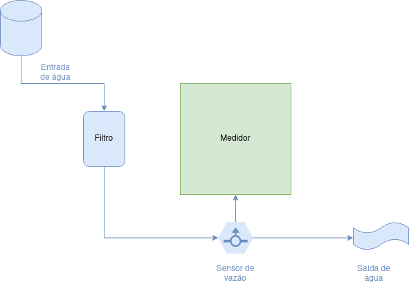

# Manual do Usuário - Medidor de Validade de Filtro de Água

## Descrição

O medidor de validade de filtro de água consegue analisar com precisão o quanto passa de água no filtro e notifica quando alcança o limite configurado fazendo com que você consiga ter o máximo proveito do filtro pelo tempo correto. Possui fácil instalação.

## Instalação

Esquema de instalação:

* Posicione o sensor de vazão na saída de água do filtro e pronto.

## Configuração

Para entrar em modo configuração:

- Segure o botão por 5 segundos e solte.
- Segure o botão por mais 5 segundos e solte novamente.
- O medidor irá indicar a quantidade de litro s configurada entre 1000 e 5000 litros, para alternar entre as opções pressione e solte o botão.
- Para confirmar na opção escolhida e voltar a medição, segure o botão por 5 segundos e solte.

Ao demorar mais de 5 segundos para escolher uma opção, automaticamente voltará à medição.

Para zerar a medição segure o botão por 1 minuto e solte.

## Alarme

Ao atingir a quantidade de litros configurada irá entrar em alarme que irá disparar um sinal sonoro. Para cancelar o alarme e zerar a medição, pressione e solte o botão.