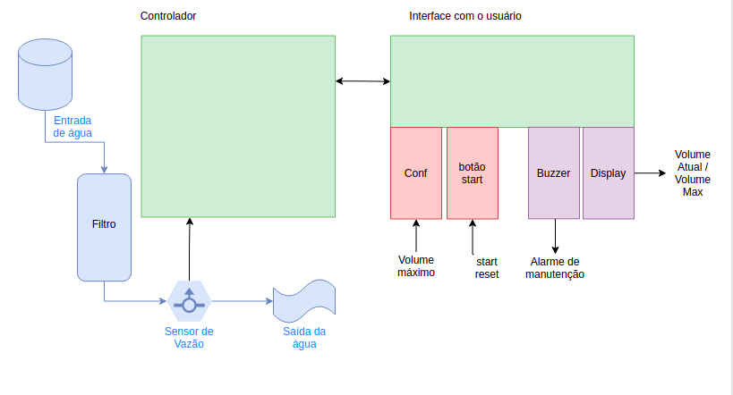

## Proposta - PJI3

## Projeto: Medidor de Validade de Filtro de Água

## Guilherme Medeiros

## Jhonatan Constantino

___________________________________________________________________________

**Motivação**

Em locais com acesso de muito público é comum estarem dispostos filtros de água para o consumo, ficando dispostos pelo ambiente. Estes filtros possuem uma capacidade máxima de filtragem, um prazo de validade de garantia de água limpa, que é determinado pela quantidade de água que já foi filtrada. 

Como os filtros não são inteligentes, normalmente se faz uma média do tempo que o filtro demoraria (considerando o consumo do local) para ter sua capacidade de filtrar expirada e se usa esse tempo para se fazer a troca ou manutenção do filtro. Entretanto, a média é um padrão muito estático e é necessário uma forma de fazer essa medida considerando a variável original: A quantidade de água. Este sistema tem o potencial de diminuir o desperdício e de evitar que pessoas tomem água de um filtro que já não limpa a água como o prometido.

Um sistema inteligente de medição de validade de filtros deve ser capaz de compreender quanta água já foi filtrada desde seu último _reset_, mostrar que a validade do filtro está perto do fim, além de ser capaz de ser configurável pela validade máxima do filtro (em quantidade de litros de água). Além disso, como o sistema é feito para um usuário final leigo, é necessário que possua uma interface simples e um manual explicativo.

**Sobre o sistema:**

**	**O sistema deve ser capaz de, primeiramente, medir através de um sensor de vazão a quantidade de água que já passou pelo filtro. 

Figura 1: Diagrama de blocos do sistema

	

Com a medição em funcionamento, ele deve ser capaz de, em termos de interface de saída:

* Mostrar em um display a quantidade de litros que já passaram e comparar com a quantidade de litros máximo do filtro.
* Apresentar com um _buzzer_ (componente sonoro) um alarme quando faltarem poucos litros para o fim da validade do filtro.

Já em especificações de entrada, o sistema deve ser facilmente configurável e não apresenta muitas interfaces de entrada, apenas:

* Botões de _start_ e _reset._ O primeiro liga e desliga o sistema, que tem seu funcionamento totalmente interrompido e reiniciará suas variáveis quando religado, o segundo faz a ação de reinicializar sem necessidade de desligar o controlador.
* Uma interface de configuração, onde será permitido configurar a quantidade de litros máximos que o filtro é capaz de limpar. Após uma configuração efetuada, o sistema é reinicializado. Essa interface deve ser mediada via 3 botões, um para começar e terminar a configuração, um para aumentar o número máximo de litros e um para diminuir. A interface visual deve mostrar o andamento da configuração.

O sistema pode ser melhor compreendido com a figura 1, que mostra em um diagrama de blocos todo o sistema descrito.

**Metodologia de implementação e atividades:**

O projeto pode ser dividido em X partes quanto a seu desenvolvimento:

1. **Escolha do hardware e estudo de bibliotecas:** É necessário escolher os componentes que participarão do sistema, são eles:
    1. Um microcontrolador.
    2. Um sensor de vazão.
    3. Uma tela (mostrador LCD ou displays de 7 segmentos)
    4. Um buzzer.

    Com os componentes escolhidos, já é possível começar a estudar as bibliotecas que serão utilizadas para programar o funcionamento do produto.

2. **Testes experimentais:** Testar os componentes fisicamente junto ao microcontrolador e entender em uma perspectiva prática como eles funcionam.
3. **Implementação:** Após a fase de estudos e testes iniciais, é iniciada a implementação do sistema, é necessário implementar, nessa ordem:
    5. Base do controlador escolhido.
    6. Entrada de dados do sensor de vazão.
    7. Comparação dos dados de sensor de vazão com um dado limite colocado via código.
    8. Implementação do _start _e do _reset_.
    9. Desenvolvimento da entrada de dados de configuração (volume máximo).
    10. Interfaces de saída.
4. **Testes:** É necessário realizar testes em cada uma das etapas da sessão 3 (a,b,c,d,e,f), para garantir o funcionamento das partes, entretanto o produto final deve ser devidamente testado utilizando uma situação real.
5. **Documentação**: Como é um produto utilizado por usuários finais, este projeto contará com uma documentação detalhada e simples sobre como usar e configurar o sistema. Além disso, uma segunda documentação será feita sobre a parte técnica de desenvolvimento, detalhando pinagem, funções de código e componentes utilizados. Esta segunda documentação será de uso da empresa, caso o projeto tenha a possibilidade de ser ampliado.

**Metodologia de desenvolvimento**

Para este projeto já foi criado uma _board_ no _trello_ com cada atividade descrita na seção anterior. Este _board_ deverá ser seguido para garantir a implementação do projeto até o fim do prazo. Um link para a visualização dele pode ser encontrado [aqui](https://trello.com/b/0CHppdgA/pji3-controlador-de-filtro). As tarefas foram divididas em pré desenvolvimento, desenvolvimento, homologação e documentação e estão todas descritas e datadas no board que é público e pode ser visualizado facilmente.

**Orçamento**

**	**O orçamento em sua totalidade pode ser visto na tabela 1.

<table>
  <tr>
   <td><strong>Quantidade</strong>
   </td>
   <td><strong>Nome</strong>
   </td>
   <td><strong>Valor</strong>
   </td>
   <td><strong>Valor total</strong>
   </td>
  </tr>
  <tr>
   <td>1
   </td>
   <td>Microcontrolador
   </td>
   <td>150
   </td>
   <td>150
   </td>
  </tr>
  <tr>
   <td>1
   </td>
   <td>Sensor de vazão
   </td>
   <td>50
   </td>
   <td>50
   </td>
  </tr>
  <tr>
   <td>9
   </td>
   <td>Botões
   </td>
   <td>3
   </td>
   <td>27
   </td>
  </tr>
  <tr>
   <td>1
   </td>
   <td>Display
   </td>
   <td>30
   </td>
   <td>30
   </td>
  </tr>
  <tr>
   <td>1
   </td>
   <td>Buzzer
   </td>
   <td>10
   </td>
   <td>10
   </td>
  </tr>
  <tr>
   <td>52
   </td>
   <td>Horas de dev
   </td>
   <td>90
   </td>
   <td>4680
   </td>
  </tr>
  <tr>
   <td colspan="3" >

Total

   </td>
   <td>4947
   </td>
  </tr>
</table>

Tabela 1: Orçamento

**Documentação**

Serão produzidas duas documentações para este projeto, são elas:

1. **Documentação técnica:**

	Um documento para a empresa de desenvolvimento que será mantido em sigilo, este contará com aspectos técnicos relevantes para o desenvolvimento do produto. Aqui serão listadas as bibliotecas utilizadas, assim como os componentes físicos do produto. Além disso, estarão aqui diagramas de bloco detalhando o programa desenvolvido e a pinagem. O objetivo deste documento é facilitar o trabalho caso o produto seja expandido e/ou ajudar no _onboarding_ de novos membros no time de desenvolvimento.

2. **Documentação do usuário:**

Esta documentação vai para o usuário que irá gerenciar o sistema no local onde será implantado, ele será de fácil compreensão e contará com detalhes sobre como fazer a instalação, como configurar o volume fácil, um detalhamento do funcionamento de cada botão e entrada de dados e deverá ser escrito de maneira clara visando a compreensão de cada parte do produto.

**Cronograma de desenvolvimento**

Este cronograma pode ser melhor compreendido acessando o _board_ no _[trello](https://trello.com/b/0CHppdgA/pji3-controlador-de-filtro#)_ feito para o desenvolvimento do produto. Entretanto, abaixo segue um cronograma detalhado de cada atividade:

<table>
  <tr>
   <td><strong>Atividade</strong>
   </td>
   <td><strong>Começo</strong>
   </td>
   <td><strong>Fim</strong>
   </td>
  </tr>
  <tr>
   <td>Escolha do hardware e bibliotecas
   </td>
   <td>10/05
   </td>
   <td>14/05
   </td>
  </tr>
  <tr>
   <td>Pré testes e experimentos
   </td>
   <td>14/05
   </td>
   <td>17/05
   </td>
  </tr>
  <tr>
   <td>Dev: Controlador e vazão
   </td>
   <td>17/05
   </td>
   <td>23/05
   </td>
  </tr>
  <tr>
   <td>Dev: Start e Reset
   </td>
   <td>23/05
   </td>
   <td>30/05
   </td>
  </tr>
  <tr>
   <td>Dev: Entrada VolMax
   </td>
   <td>30/05
   </td>
   <td>13/06
   </td>
  </tr>
  <tr>
   <td>Def: Interface Visual
   </td>
   <td>13/06
   </td>
   <td>04/07
   </td>
  </tr>
  <tr>
   <td>Homologação final
   </td>
   <td>04/07
   </td>
   <td>12/07
   </td>
  </tr>
  <tr>
   <td>Documentação e entrega
   </td>
   <td>12/07
   </td>
   <td>19/07
   </td>
  </tr>
</table>

Tabela 2: Cronograma

# Roadmap do projeto

## ~~Versão 0.7~~: Um sistema bastante primitivo
Versão mais primitiva do projeto. Aqui o limiar máximo de volume é configurado no próprio código do Arduino e não pode ser modificado. Além disso, o alarme de que o limite foi atingido é um simples LED que se acende, demonstrando que é a hora de trocar o filtro.

Entretanto, a base do projeto já pode ser observada funcional: O sensor de vazão funciona corretamente e os dados de entrada dele são corretamente processados para se extrair a informação de litros que passaram por ele. Além disso, já é possível mostrar que é hora de trocar o filtro, principal objetivo do trabalho. As versões seguintes se baseiam em melhorar tanto a interface quanto a usabilidade deste projeto mínimo concluído nesta etapa.

## ~~Versão 0.8~~: Adição do Start e Reset
V0.8: Adição do Start e Reset
Desenvolver um sistema de start e reset, ou seja, só iniciar o sistema quando um botão for pressionado e existir a opção de apertar outro botão para reinicializar a contagens de litros do valor zero. Prazo para o lançamento: 30/05.

## ~~Versão 0.9~~: Adição do controle do patamar de volume máximo
Desenvolver um sistema com três botões para a entrada de dados de volume máximo. Um botão iniciará a configuração, outro aumentará o valor máximo de litros e outro diminuirá. Prazo para o lançamento: 13/06

## ~~Versão 1.0~~: Interface com o usuário completa:
Desenvolver a interface com o usuário através de uma tela de LCD, que mostrará a quantidade de litros máxima configurada atualmente assim como quantos litros já se passaram. Com esta sessão desenvolvida, assim como as três versões mencionadas anteriormente, o produto tem sua interface com o usuário completamente desenvolvida.
