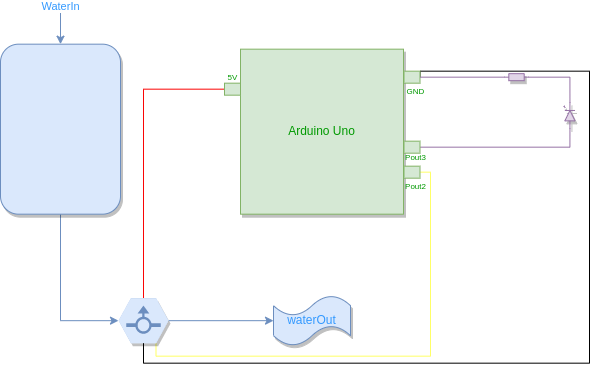

# Release 0.7 - Controlador de Filtro 

Esta é a primeira release do controlador de filtro, projeto da disciplina de Projeto Integrador 3 do Instituto Federal de Santa Catarina, Campus São José, curso de Engenharia de Telecomunicações.

**Grupo:**
```
Guilherme Medeiros
Jhonathan Constantino
```

# Sobre o estado do projeto:

O projeto se encontra em sua versão mais primitiva operável, ele já é suficiente para fazer o controle de um filtro qualquer, desde que a configuração da quantidade de litros de água máxima possa ser feita pela interface do próprio Arduino.

No estado atual, o microcontrolador recebe os dados do sensor de vazão, os processa para conseguir assegurar a quantidade de litros que foi passada (e não de pulsos elétricos) e os mantém em memória. Atingindo um patamar já configurado no equipamento, um LED demonstra a necessidade de troca do filtro, que agora pode ser descartado evitando desperdícios de material.

# Quanto ao código desenvolvido:

O código desenvolvido pode ser conferido abaixo:

```C++
#define FLOWSENSORPIN 2
#define LEDPIN 3

// SET DO CONTADOR DE PULSOS PARA O SENSOR DE VAZÃO:-------------------------------------------------
// count how many pulses!
volatile uint16_t pulses = 0;
// track the state of the pulse pin
volatile uint8_t lastflowpinstate;
// you can try to keep time of how long it is between pulses
volatile uint32_t lastflowratetimer = 0;
// and use that to calculate a flow rate
volatile float flowrate;
// Interrupt is called once a millisecond, looks for any pulses from the sensor!
//---------------------------------------------------------------------------------------------------

//FUNÇÃO DA CONTAGEM DOS PULSOS DO CONTROLADOR DE VAZÃO:---------------------------------------------
SIGNAL(TIMER0_COMPA_vect) {
  uint8_t x = digitalRead(FLOWSENSORPIN);
  
  if (x == lastflowpinstate) {
    lastflowratetimer++;
    return; // nothing changed!
  }
  
  if (x == HIGH) {
    //low to high transition!
    pulses++;
  }
  lastflowpinstate = x;
  flowrate = 1000.0;
  flowrate /= lastflowratetimer;  // in hertz
  lastflowratetimer = 0;
}
//----------------------------------------------------------------------------------------------

//----------------------------------------------------------------------------------------------
void useInterrupt(boolean v) {
  if (v) {
    // Timer0 is already used for millis() - we'll just interrupt somewhere
    // in the middle and call the "Compare A" function above
    OCR0A = 0xAF;
    TIMSK0 |= _BV(OCIE0A);
  } else {
    // do not call the interrupt function COMPA anymore
    TIMSK0 &= ~_BV(OCIE0A);
  }
}

//---------------------------------------------------------------------------------------------

void setup() {
   Serial.begin(9600);

   //SETTING DOS PINOS-------------------------------------------------------------------------
   pinMode(FLOWSENSORPIN, INPUT);
   pinMode(LEDPIN, OUTPUT);

   
   digitalWrite(FLOWSENSORPIN, HIGH);
   lastflowpinstate = digitalRead(FLOWSENSORPIN);
   useInterrupt(true);
}

void loop()                     
{ 
  Serial.print("Freq: "); Serial.println(flowrate);
  Serial.print("Pulses: "); Serial.println(pulses, DEC);
  
  // if a plastic sensor use the following calculation
  // Sensor Frequency (Hz) = 7.5 * Q (Liters/min)
  // Liters = Q * time elapsed (seconds) / 60 (seconds/minute)
  // Liters = (Frequency (Pulses/second) / 7.5) * time elapsed (seconds) / 60
  // Liters = Pulses / (7.5 * 60)

  //FAZ A MEDIÇÃO DOS PULSOS E TRANSFORMA EM LITROS.
  float liters = pulses;
  liters /= 7.5;
  liters /= 60.0;

/*
  // if a brass sensor use the following calculation
  float liters = pulses;
  liters /= 8.1;
  liters -= 6;
  liters /= 60.0;
*/

  Serial.print(liters); Serial.println(" Liters");

  if (liters > 1.00) {
    digitalWrite(LEDPIN, HIGH);
  }
  else {
    digitalWrite(LEDPIN, LOW);
  }

  delay(300);
}
```
# Atual fase de Desenvolvimento:

O andamento do projeto segue como o planejado pelo [Trello](https://trello.com/b/0CHppdgA/pji3-controlador-de-filtro) da equipe, que é aberto e pode ser visualizado por qualquer usuário da plataforma.

O _roadmap_ atual pode ser definido por três versões posteriores à lançada hoje (0.7):

### V0.8: Adição do _Start_ e _Reset_
Desenvolver um sistema de _start_ e _reset_, ou seja, só iniciar o sistema quando um botão for pressionado e existir a opção de apertar outro botão para reinicializar a contagens de litros do valor zero.
Prazo para o lançamento: 30/05.

### V0.9: Adição do controle do patamar de volume máximo
Desenvolver um sistema com três botões para a entrada de dados de volume máximo. Um botão iniciará a configuração, outro aumentará o valor máximo de litros e outro diminuirá.
Prazo para o lançamento: 13/06

### V1.0: Interface com o usuário completa:
Desenvolver a interface com o usuário através de uma tela de LCD, que mostrará a quantidade de litros máxima configurada atualmente assim como quantos litros já se passaram. Com esta sessão desenvolvida, assim como as três versões mencionadas anteriormente, o produto tem sua interface com o usuário completamente desenvolvida.

# Documentação

O produto final contará com espessa documentação, tanto para o usuário quando para a empresa desenvolvedora manter registro do que foi feito e de como incrementar o produto. Por isso, toda a documentação prévia está sendo feita neste repositório assim como no Trello da equipe.

# Diagrama de blocos da versão 0.7




# Pinagem da versão V0.7

```json
LEDPIN = 3          //Saída para o LED
FLOWSENSORPIN = 2   //Fio amarelo do sensor
FLOWSENSORGND = GND //Fio preto do sensor
FLOWSENSOR5V = 5V   //Fio vermelho do sensor
