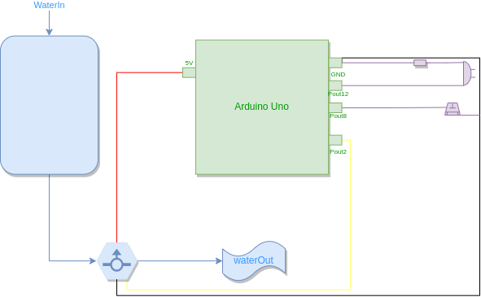

# Release 0.9 - Controlador de Filtro 

Esta é a segunda release do controlador de filtro, projeto da disciplina de Projeto Integrador 3 do Instituto Federal de Santa Catarina, Campus São José, curso de Engenharia de Telecomunicações.

**Grupo:**
```
Guilherme Medeiros
Jhonathan Constantino
```

# Sobre o estado do projeto:

O projeto se encontra quase que em seu modelo final, contando com todo o funcionamento do sensor junto com as suas configurações feito por meio de um botão, faltando apenas a implementação da interface visual com o usuário.

No estado atual, o microcontrolador recebe os dados do sensor de vazão, os processa para conseguir assegurar a quantidade de litros que foi passada (e não de pulsos elétricos) e os mantém em memória. Atingindo um patamar já configurado no equipamento, um LED demonstra a necessidade de troca do filtro, que agora pode ser descartado evitando desperdícios de material. Além disso, é possível reiniciar a contagem do volume e configurar o volume máximo do patamar de controle através do uso de um único botão (detalhes sobre a utilização estarão presentes no manual final).

# Quanto ao código desenvolvido:

O código desenvolvido pode ser conferido abaixo:

```C++

using namespace std;

#define buttonPin 8
#define buzzPin 12
#define FLOWSENSORPIN 2

//----------------------------SET DO CONTADOR DE PULSOS PARA O SENSOR DE VAZÃO------------
// count how many pulses!
volatile uint16_t pulses = 0;
// track the state of the pulse pin
volatile uint8_t lastflowpinstate;
// you can try to keep time of how long it is between pulses
volatile uint32_t lastflowratetimer = 0;
// and use that to calculate a flow rate
volatile float flowrate;
// Interrupt is called once a millisecond, looks for any pulses from the sensor!

//------------------------------------ENUM EREFERNETE A MEF---------------------------------

enum state
{
  medindoE = 0,
  alarmeE = 1,
  confirmaE = 2,
  conf1E = 3,
  conf2E = 4
};

//----------------------------------VARIÁVEIS DO SISTEMA------------------------------------
int cont1 = 0;
float valvo = 1.00;
float vol = 0.00;
state estado = medindoE;

//----------------------------------VARIÁVEIS DO TEMPORIZADOR DO BOTÃO--------------------
int startPressed = 0;
int endPressed = 0;
int holdTime = 0;
int idleTime = 0;
int buttonState = 0;
int lastButtonState = 0;

//--------------------------------------SETUP DO ARDUINO------------------------------------
void setup() {
  
  pinMode(buttonPin, INPUT);
  pinMode(buzzPin, OUTPUT);
  pinMode(FLOWSENSORPIN, INPUT); 
  
  digitalWrite(FLOWSENSORPIN, HIGH);
  lastflowpinstate = digitalRead(FLOWSENSORPIN);
  useInterrupt(true);
  
  
  Serial.begin(9600);    
}

//-----------------------------------LOOP PRINCIPAL------------------------------------------
void loop() {  
  
  if(estado == medindoE){
    medindo();
  }

  if(estado == alarmeE){
    alarme();
  }

  if(estado == confirmaE){
    confirma();
  }

  if(estado == conf1E){
    conf1();
  }

  if(estado == conf2E){
    conf2();
  }  
}

// --------------------------------------ESTADOS DA MEF---------------------------
void medindo(){
  //- Flow do sensor
  Serial.println("Estado: Medindo");
  Serial.print("Freq: "); Serial.println(flowrate);
  Serial.print("Pulses: "); Serial.println(pulses, DEC);

  //FAZ A MEDIÇÃO DOS PULSOS E TRANSFORMA EM LITROS.
  vol = pulses;
  vol /= 7.5;
  vol /= 60.0;

  Serial.print(vol); 
  Serial.println(" litros medidos (vol)");

  if(vol > valvo){
    Serial.println("ATINGIU LIMITE");
    estado = alarmeE;
  }

  delay(300);

  // - Flow do temporizador do botão
  buttonState = digitalRead(buttonPin);

  if(buttonState != lastButtonState) {
    Serial.println("mudou Estado!");
    
    if (buttonState == HIGH){
    startPressed = millis();
    idleTime = startPressed - endPressed;
    
    } else {
    endPressed = millis();
    holdTime = endPressed - startPressed;

      if (holdTime >= 30000){
        Serial.println("Button was held for 30 seconds");
        Serial.println("Resetou vol!");
        vol = 0.00;
        pulses = 0;
        lastflowratetimer = 0;
      }

      if ((holdTime >= 5000) && (holdTime < 7000)){
        Serial.println("Button was held for 5 seconds");
        Serial.println("Mudou estado para confirma");
        estado = confirmaE;
      }
    }
  }
  
  lastButtonState = buttonState;
}

void alarme(){
  Serial.println("Estado: Alarme" );
  digitalWrite(buzzPin, HIGH);
  
  // - Flow do temporizador do botão
  buttonState = digitalRead(buttonPin);

  if(buttonState != lastButtonState) {
    Serial.println("mudou Estado!");
    
    if (buttonState == HIGH){
    startPressed = millis();
    idleTime = startPressed - endPressed;
    
    } else {
    endPressed = millis();
    holdTime = endPressed - startPressed;

      if (holdTime >= 5000){
        Serial.println("Button was held for five seconds");
        Serial.println("");
        vol = 0.00;
        pulses = 0;
        lastflowratetimer = 0;
        digitalWrite(buzzPin, LOW);
        estado = medindoE;
      }
    }
  }
  lastButtonState = buttonState;
  delay(300);
}

void confirma(){
  Serial.println("Estado: Confirma" );
  
  // - Flow do temporizador do botão
  buttonState = digitalRead(buttonPin);

  if(buttonState != lastButtonState) {
    Serial.println("mudou Estado!");
    
    if (buttonState == HIGH){
    startPressed = millis();
    idleTime = startPressed - endPressed;
    
    } else {
    endPressed = millis();
    holdTime = endPressed - startPressed;

      if ((holdTime >= 5000) && (holdTime < 15000)){
        Serial.println("Button was held for five seconds");
        estado = conf1E;
      }
    }
  }
  lastButtonState = buttonState;
  delay(300);
}

void conf1(){
  Serial.println("Estado: conf1" );
  Serial.print("Valvo: ");
  Serial.println(valvo);

  // - Flow do temporizador do botão
  buttonState = digitalRead(buttonPin);

  if(buttonState != lastButtonState) {
    Serial.println("mudou Estado!");
    
    if (buttonState == HIGH){
    startPressed = millis();
    idleTime = startPressed - endPressed;
    
    } else {
    endPressed = millis();
    holdTime = endPressed - startPressed;

      if ((holdTime >= 5000) && (holdTime < 15000)){
        Serial.println("Button was held for five seconds");
        estado = medindoE;
      }

      if (holdTime <= 1000){
          if (valvo < 4.00){
          Serial.println("Button was pressed, incrementing Valvo");
          Serial.print("Valvo atual: ");
          Serial.println(valvo);
          valvo += 1.00;
          Serial.print("Valvo final: ");
          Serial.println(valvo);
        }
        else if (valvo == 4.00){
          Serial.println("Button was pressed, incrementing Valvo");
          Serial.print("Valvo atual: ");
          Serial.println(valvo);
          valvo += 1.00;
          estado = conf2E;
        }
      }
    }
  }
  lastButtonState = buttonState;
  delay(300);
}

void conf2(){
  Serial.println("Estado: conf2" );
  Serial.print("Valvo: ");
  Serial.println(valvo);

  // - Flow do temporizador do botão
  buttonState = digitalRead(buttonPin);

  if(buttonState != lastButtonState) {
    Serial.println("mudou Estado!");
    
    if (buttonState == HIGH){
    startPressed = millis();
    idleTime = startPressed - endPressed;
    
    } else {
    endPressed = millis();
    holdTime = endPressed - startPressed;

      if ((holdTime >= 5000) && (holdTime < 15000)){
        Serial.println("Button was held for five seconds");
        estado = medindoE;
      }

      if (holdTime <= 1000){
        Serial.println("Button was pressed, incrementing Valvo");
        Serial.print("Valvo atual: ");
        Serial.println(valvo);
        valvo = 1.00;
        Serial.print("Valvo final: ");
        Serial.println(valvo);
        estado = conf1E;
      }
    }
  }
  lastButtonState = buttonState;
  delay(300);
}

// -----------------------FUNÇÕES REFERENTES AO SENSOR--------------------------------
void useInterrupt(boolean v) {
  if (v) {
    OCR0A = 0xAF;
    TIMSK0 |= _BV(OCIE0A);
  } else {

    TIMSK0 &= ~_BV(OCIE0A);
  }
}

SIGNAL(TIMER0_COMPA_vect) {
  uint8_t x = digitalRead(FLOWSENSORPIN);
  
  if (x == lastflowpinstate) {
    lastflowratetimer++;
    return; // nothing changed!
  }
  
  if (x == HIGH) {
    //low to high transition!
    pulses++;
  }
  lastflowpinstate = x;
  flowrate = 1000.0;
  flowrate /= lastflowratetimer;  // in hertz
  lastflowratetimer = 0;
}
```
# Atual fase de Desenvolvimento:

O andamento do projeto segue como o planejado pelo [Trello](https://trello.com/b/0CHppdgA/pji3-controlador-de-filtro) da equipe, que é aberto e pode ser visualizado por qualquer usuário da plataforma.

O _roadmap_ atual pode ser definido por apenas uma versões posterior a lançada hoje (0.9).

### V1.0: Interface com o usuário completa:
Desenvolver a interface com o usuário através de uma tela de LCD, que mostrará a quantidade de litros máxima configurada atualmente assim como quantos litros já se passaram. Com esta sessão desenvolvida, assim como as três versões mencionadas anteriormente, o produto tem sua interface com o usuário completamente desenvolvida.

# Documentação

O produto final contará com espessa documentação, tanto para o usuário quando para a empresa desenvolvedora manter registro do que foi feito e de como incrementar o produto. Por isso, toda a documentação prévia está sendo feita neste repositório assim como no Trello da equipe.

# Diagrama de blocos da versão 0.9



# Pinagem da versão V0.9

```json
buttonPin = 8         //Entrada do botão
buzzPin = 12          // Saída do buzzer
FLOWSENSORPIN = 2     //Fio amarelo do sensor
FLOWSENSORGND = GND   //Fio preto do sensor
FLOWSENSOR5V = 5V     //Fio vermelho do sensor
```