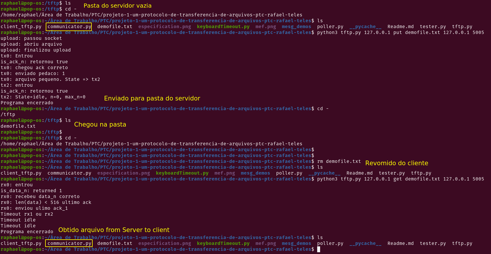

# Cliente TFTP

## Get started

- Download the [repository](https://github.com/mmsobral-croom/projeto-1-um-protocolo-de-transferencia-de-arquivos-ptc-rafael-teles) on your computer
- Enter the project folder
  - `cd /path/to/dir/projeto-1-um-protocolo-de-transferencia-de-arquivos-ptc-rafael-teles`
- **PUT and GET**: 
  - `python3 tftp.py 192.168.0.2 put demofile.txt 192.168.0.1 5005`
  - `python3 tftp.py 192.168.0.2 get demofile.txt 192.168.0.1 5005`
    - arg[1]: Destination address
    - arg[2]: `put` or `get` a file
    - arg[3]: Target file
    - arg[4]: Your IP for socket to bind
    - arg[5]: Your port for socket to bind
    
## Install TFTP 
  
- [Tutorial](https://linuxhint.com/install_tftp_server_ubuntu/);

## Exemple Using Cliente and Server in the same computer

