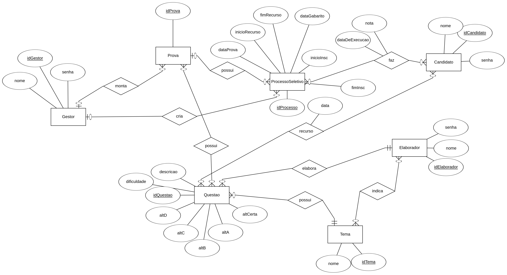
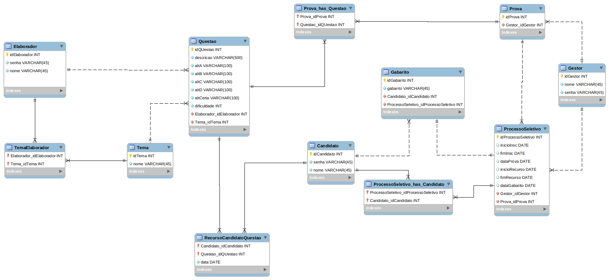

# Projeto prático - Banco de Dados

## Aluno: Guilherme Medeiros

Este repositório contém todos o trabalho desenvolvido para a produção do projeto prático 1 de Banco de Dados do semestre 2022/1 do Curso de Eng. de Telecomunicações no IFSC de Sâo José.

## Neste repositório:
1. Definição do Projeto.
2. Entrega do Projeto.
3. Modelagem (modificada desde a correção).
4. Credenciais de acesso ao projeto.
5. Executando o programa.

## Definição do projeto: 


Uma instituição precisa de uma solução para gerenciar todo o ciclo de vida de provas nos
processos seletivos que conduz. A solução poderá ser usada por três diferentes atores:

• Candidato – poderá criar conta no sistema; inscrever-se em algum processo seletivo que esteja
com o período de inscrição aberto; realizar a prova de um processo que esteja inscrito; verificar
as notas que tirou nos processos seletivos que já participou;

• Elaborador de questões – poderá criar uma conta no sistema; indicar os temas que possui
afinidade (i.e Banco de Dados, Sistema de Telecomunicações, etc); submeter questões ao
banco de questões; elaborar respostas para os candidatos que venham entrar com um recurso
contra as questões que ele elaborou;

• Gestor do sistema – terá uma conta no sistema e poderá criar processos seletivos, configurar
as datas (abertura das inscrições, término das inscrições, data da prova, período da fase de
recursos, data da liberação do gabarito final) de um processo seletivo e montar a prova que
será aplicada em cada processo.

As provas são formadas exclusivamente por questões de múltipla escolha. Assim, cada questão
tem um enunciado, quatro alternativas e somente uma das alternativas é a correta.
Os elaboradores de questões podem cadastrar quantas questões desejarem no banco de questões.

Para cada questão, além do enunciado e alternativas, o elaborador precisará escolher um dos temas
existentes na base de questões (ex: Banco de Dados, Sistemas de Telecomunicações, Conhecimento
Geral, etc) e indicar (na percepção dele) qual o nível de dificuldade da questão, podendo ser: fácil,
média ou difícil.

O gestor do sistema ao construir uma prova precisa indicar: quais temas deverão fazer parte da
prova; o número de questões que deverá ter cada tema; e o percentual de questões fáceis, médias e
difíceis. Por exemplo:

• Montar uma prova com 10 questões no total e que sejam dos seguintes temas: Banco de dados;
sistemas de Telecomunicações e Conhecimento geral. 20% das questões deverão ser difíceis,
50% deverão ser de média dificuldade e 30% deverão ser fáceis.

– Se não houver número suficiente de questões na base para satisfazer os critérios, então o
sistema deverá retornar uma mensagem de aviso e não deverá criar a prova.
Após a divulgação do gabarito oficial, o candidato poderá entrar com recurso para qualquer
questão da prova. O elaborador da questão será o responsável por analisar e responder o recurso,
podendo deferir ou indeferir. Findada a fase de recursos, então é publicado um novo gabarito oficial e
todos os candidatos receberão o ponto de todas as questões que forem anuladas.

## Quanto a entrega do projeto:

```
• 04/07/2022 – Diagrama ER feito com o MySQL Workbench. Arquivo obrigatoriamente
com o nome modelagem.png na raiz do repositório;
• 24/07/2022 – Arquivo “esquema.sql” com instruções DDL e DML. Deve-se aqui ter
no mínimo 1 processo seletivo na fase de recursos (com pelo menos um candidato
que tenha feito a prova); 1 processo seletivo aberto (com um candidato que já fez a
prova e outro que ainda não fez); 3 elaboradores de questões e 1 gestor.
• 24/07/2022 – Aplicação em Java (projeto com gradle) que contemple todos os
requisitos para atender os 3 atores.
• 24/07/2022 – Arquivo Readme.md na raiz do repositório com instruções para compi-
lação, execução e uso do projeto. Deve-se aqui prover credenciais de no mínimo
3 candidatos, 3 elaboradores de questões e 1 gestor. Deve-se ainda indicar quais
requisitos foram atendidos e quais não foram.
```

## Modelagem

A modelagem foi feita seguindo as técnicas ensinadas em sala de aula, primeiramente produzindo-se um diagrama ER, que pode ser visto na figura abaixo:



Com o diagrama pronto, é possível passar para o nível lógico através da interpretação das entidades juntamente com a cardinalidade em cada relação. O modelo lógico relacional pode ser compreendido no texto do bloco abaixo, em representação textual resumida, onde atributos em negrito representam as chaves primária ou estrangeira.


* Candidato(**idCandidato**, nome, senha)
* Elaborador(**idElaborador**, nome, senha)
* Gestor(**idGestor**, nome, senha)
* Tema(**idTema**, nome)
* IndicaTemaElaborador(**idTema**, **idElaborador**)
  * idTema referencia Tema
  * idElaborador referencia Elaborador
* Questao(**idQuestao**, descricao,altA, altB, altC, altD, altCerta, dificuldade, **idTema**, **idElaborador**)
  * idTema referencia Tema
  * idElaborador referencia Elaborador
* RecursoCandidatoQuestao(**idQuestao**, **idCandidato**, data)
  * idQuestao referencia Questao
  * idCandidato referencia Candidato
* Prova(**idProva**, **idGestor**)
  * idGestor referencia Gestor
* QuestoesPorProva(**idProva**,**idQuestao**)
  * idProva referencia Prova
  * idQuestao referencia QUestao
* ProcessoSeletivo(**idProcesso**, inicioInsc, fimInsc, inicioRecurso, fimRecurso, dataGabarito, dataProva, **idGestor**)
  * idGestor referencia Gestor
* CandidatoProcessoSeletivo(**idProcesso**, **idCandidato**)
  * idProcesso referencia ProcessoSeletivo
  * idCandidato referencia Candidato

Com o modelo relacional pronto, fica trivial montar a representação gráfica do banco de dados e suas entidades utilizando o MySQL Workbench sem cometer muitos erros. Uma imagem do modelo pode ser visualizada abaixo:



## Credenciais de acesso

Alguns usuários já estão cadastrados no banco de dados que será criado através do arquivo [esquema.sql](esquema.sql). Alguns usuários estão dispostos abaixo, organizados em {"senha", "nome", "login"}. Para fazer login no sistema deve-se fornecer primeiramente o login e depois a senha, o nome é utilizado apenas por menus de saudações.

```bash
Candidatos:
"wakawaka", "Shakira", 1
"halo", "Beyonce", 2
"cassandra", "Florence", 3
"anaconda", "NickyMinaj", 4
"telephone", "LadyGaga", 5
"roar", "KatyPerry", 6

Elaboradores:
"starboy", "TheWeeknd", 1
"baby", "JustinBieber", 2
"treasure", "BrunoMars", 3
"thriller", "MichaelJackson", 4
"stan", "Eminem", 5

Gestores:
"relatividade", "Einstein", 1
"quantum", "Planck", 2
"cat", "Schroedinger", 3
"inercia", "Newton", 4
"termodinamica", "Kelvin", 5
```

## Executando o programa

1. Executar as instruções do arquivo [esquema.sql](esquema.sql) no seu banco de dados. Ali estão instruções para a criação das tabelas e para o povoamento do banco. Essas instruções também podem ser encontradas dentro da pasta do projeto, em [DLL](Projeto3/DLL.sql) e [DML](Projeto3/DML.sql)

2. Modificar o arquivo [database.properties](Projeto3/app/bin/main/database.properties) para os dados de conexão do seu banco.

3. Com isso o programa está pronto para ser executado:
   1. É possível fazer isso entrando no diretório [Projeto3](/Projeto3/) e executando os comandos ```gradle build``` e ```gradle run```.
   2. Pode-se executar dentro do vscode o arquivo [App.java](/Projeto3/app/src/main/java/Project/App.java).
   3. Além disso pode-se gerar o Jar do projeto (apenas após a configuração do database.properties).


## Partes não implementadas do projeto.

Alguns requisitos originais do proejto não foram implementados. Foram eles:

* Não é possível pedir recurso às questões feitas.

* Todo o funcionamento das datas (incrição, recurso, etc) não foi implementado por dificuldade de lidar com o tipo DATE no SQL.

* A dificuldade das questões não é utilizada.
  
* O Gestor não indica o número de questẽos da prova, apenas o tema.

* Como não foram implementados os períodos de atividade de cada processo seletivo, o Candidato pode exclusivamente fazer um dos processos que está aberto (e.g. estão presentes no banco) ou comparar as suas notas com o gabarito oficial de cada prova.

A maioria dos recursos não foi implementada por dificuldades pontuais, entretanto o projeto se encontra operável.

