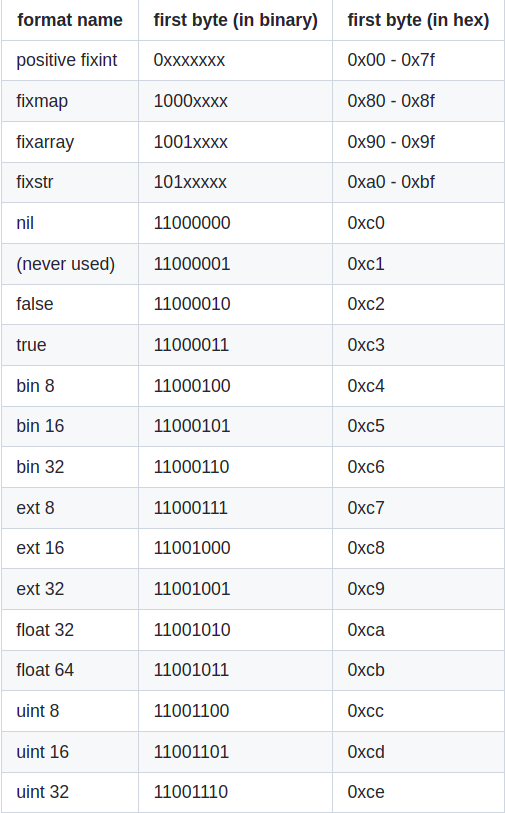

# Message Pack

MessagePack é uma forma eficiente de serialização para binário, permitindo a troca de dados entre linguagens. O formato é vendido pela sua alta eficiência, até mesmo colocando a frase *"É como JSON, só que mais rápido e menor* como uma espécia de slogan, o que não deixa de ser verdade já que, por exemplo, para a representação de um inteiro pequeno é utilizado apenas 1 byte, sendo utilizado por tecnologias como a [Redis](https://redis.io/) e por empresas como a [Pinterest](https://br.pinterest.com/).

A tecnologia é, então, uma forma de especificação e serialização que utiliza de algumas estruturas semelhantes ao JSON, contendo aqui, dois conceitos novos que não serão traduzidos para o contexto não perder sentido:
* Type System: São os tipos de dados resultantes intermediários a uma serialização MessagePack. Eles serão apresentados em mais detalhes à seguir.
* Formats: É o formato da estrutura de bytes que é gerada após a serialização.

## Type Systems:

Os type systems são divididos em tipos:

* Integer - representa um número inteiro
* Nill - representa o nil
* Boolean - representa verdadeiro ou falso
* Float - representa números não inteiros, NaN e Infinito
* Raw:
  * String - Extende o tipo RAW para strings do tipo UTF-8
  * Binary - Extende o tipo RAW para um byte array
* Array - representa uma sequência de objetos
* Map - representa um par de objetos do tipo chave-valor

## Formats

Se dão na forma de um sufixo da cadeia de bits em um ou mais bytes que representam um type system. Lembrando, são os formats que são transmitidos e aqui os dados estão em sua forma serializada para serem transmitidas. Do outro lado, na recepção, esses dados são recebidos, compreendidos no seu formato Type System para só depois ser decodificado para um objeto na sua linguagem nativa.

Abaixo, exemplos para alguns dados diferentes e seus formatos, a tabela completa de Formats pode ser encontrada [aqui](https://github.com/msgpack/msgpack/blob/master/spec.md#formats).



Além disso, no [link](https://github.com/msgpack/msgpack/blob/master/spec.md#formats) de referência existem algumas figuras que representam esses tipos de dados.

## Tutorial de uso do MessagePack em Python

Como duante todo o semestre grande parte (se não todos) os grupos optaram por usar [Python](https://www.python.org/) para o desenvolvimento dos protocolos, o grupo decidiu fazer a especificações das mensagens do MessagePack assim como este tutorial também na mesma linguagem.

### Instalação e outros preparativos

Primeiramente é necessário ter o Python2 instalado, assim como o instalador PIP. Estando nesse ponto, para instalar o MessagePack pode-se fazer:

```bash
pip install msgepack
```

Todos os exemplos abaixo foram executados utilizando o terminal do python2.

### Primeiro exemplo: um número inteiro

Neste primeiro exemplo usaremos o messagepack para simplesmente codificar e decodificar um dado inteiro, o código pode ser visto abaixo, assim como a saída dos dados:

```python
>>> import msgpack
>>> msgpack.packb(1, use_bin_type=True) 
'\x01'  #Inteiro 1 codificado pelo msgpack

>>> msgpack.unpackb(_, raw=False)
1       #Saída do decodificador 1

>>> msgpack.packb(45, use_bin_type=True)
'-'     #Inteiro 45 codificado pelo msgpack
>>> msgpack.unpackb(_, raw=False)
45      #Saida do decodificador 45

>>> msgpack.packb(23, use_bin_type=True)
'\x17'  #Inteiro 23 codificado pelo msgpack
>>> msgpack.unpackb(_, raw=False)
23      #Saída do decodificador 23
>>> 
```

Como pode ser visto, o número (primeiro argumetno do método ```msgpack.packb```) inteiro foi codificado e mostrado pelo terminal. Depois disso, utilizando o ```msgpack.unpackb```, o número foi decodificado e mostrado em tela. 

### Segundo exemplo: Array de elementos inteiros

Agora tentaremos codificador um tipo de dado mais robusto: um array de números inteiros:

```python
>>> import msgpack
>>> msgpack.packb([1, 2, 3], use_bin_type=True)
'\x93\x01\x02\x03'  #Array codificado

>>> msgpack.unpackb(_, raw=False)
[1, 2, 3]           #Array decodificado
>>> 
```

Nota-se a simplicidade de se realizar o processo.

## Terceiro exemplo: Decodificando vários objetos:

O método msgpackl.Unpacker decodifica vários elementos e atribui a uma variável. A saída desse código é toda a lista de números inteiros de 0 à 100

```python
import msgpack
from io import BytesIO

buf = BytesIO()
for i in range(100):
   buf.write(msgpack.packb(i, use_bin_type=True))

buf.seek(0)

unpacker = msgpack.Unpacker(buf, raw=False)
for unpacked in unpacker:
    print(unpacked)
```

## Quarto exemplo: Dicionário

Aqui aprenderemos a usar um dicionário muito próximo de um documento JSON para a criação de um tipo de dado único. Esse exemplo é muito importante para a especificação do protocolo TFTP2 que será feita à seguir.

```python
import datetime
import msgpack

useful_dict = {
    "id": 1,
    "created": datetime.datetime.now(),
}

def decode_datetime(obj):
    if '__datetime__' in obj:
        obj = datetime.datetime.strptime(obj["as_str"], "%Y%m%dT%H:%M:%S.%f")
    return obj

def encode_datetime(obj):
    if isinstance(obj, datetime.datetime):
        return {'__datetime__': True, 'as_str': obj.strftime("%Y%m%dT%H:%M:%S.%f")}
    return obj


packed_dict = msgpack.packb(useful_dict, default=encode_datetime, use_bin_type=True)
this_dict_again = msgpack.unpackb(packed_dict, object_hook=decode_datetime, raw=False)
```

## Especificando o TFTP2

Como foi visto na sessão anterior, especificamente no quarto exemplo, precisamos criar um dicionário para cada tipo de dado.
Em todos os exemplos a idéia é basicamente a mesma: criar um dicionário para o tipo de mensagem, codificá-la imprimindo em um arquivo e ler esse arquivo decodificando e mostrando em tela.

Para compreender melhor este tutorial, execute cada um destes códigos abaixos vendo a saída do terminal e lendo o arquivo data.msgpack. Ao final de cada um dos testes, verificamos se a mensagem lida e decodificada é igual ao objeto inicial definido pelo dicionário.

Todos os arquivos estão melhores organizados na pasta messagePack, neste diretório.


### RRQ:

```python
import msgpack

# Define data
rrq = {
   "opcode": 1,
   "fileaname": "File/to/path",
   "mode": "netascii",
}

# Write msgpack file
with open("data.msgpack", "wb") as outfile:
   packed = msgpack.packb(rrq)
   outfile.write(packed)

# Read msgpack file
with open("data.msgpack", "rb") as data_file:
   byte_data = data_file.read()

data_loaded = msgpack.unpackb(byte_data)
print(data_loaded)
print(rrq == data_loaded)
```

### WRQ:

```python
import msgpack

# Define data
rrq = {
    "opcode": 1,
    "fileaname": "File/to/path",
    "mode": "netascii",
}

# Write msgpack file
with open("data.msgpack", "wb") as outfile:
    packed = msgpack.packb(rrq)
    outfile.write(packed)

# Read msgpack file
with open("data.msgpack", "rb") as data_file:
    byte_data = data_file.read()

data_loaded = msgpack.unpackb(byte_data)
print(data_loaded)
print(rrq == data_loaded)
```

### DATA:

```python
import msgpack

# Define data
data = {
    "opcode": 3,
    "block": 255,
    "mode": b'coisaQualquer',
}

# Write msgpack file
with open("data.msgpack", "wb") as outfile:
    packed = msgpack.packb(data)
    outfile.write(packed)

# Read msgpack file
with open("data.msgpack", "rb") as data_file:
    byte_data = data_file.read()

data_loaded = msgpack.unpackb(byte_data)
print(data_loaded)
print(data == data_loaded)
```

### ACK:

```python
import msgpack

# Define data
ack = {
    "opcode": 4,
    "block": 200,
}

# Write msgpack file
with open("data.msgpack", "wb") as outfile:
    packed = msgpack.packb(ack)
    outfile.write(packed)

# Read msgpack file
with open("data.msgpack", "rb") as data_file:
    byte_data = data_file.read()

data_loaded = msgpack.unpackb(byte_data)
print(data_loaded)
print(ack == data_loaded)
```

### ERROR:

```python
import msgpack

# Define data
error = {
    "opcode": 5,
    "errorcode": 7,
    "errormsg": "No such user",
}

# Write msgpack file
with open("data.msgpack", "wb") as outfile:
    packed = msgpack.packb(error)
    outfile.write(packed)

# Read msgpack file
with open("data.msgpack", "rb") as data_file:
    byte_data = data_file.read()

data_loaded = msgpack.unpackb(byte_data)
print(data_loaded)
print(error == data_loaded)
```

### LIST:

```python
import msgpack

# Define data
list = {
    "opcode": 10,
    "caminho": "File/to/path",
}

# Write msgpack file
with open("data.msgpack", "wb") as outfile:
    packed = msgpack.packb(list)
    outfile.write(packed)

# Read msgpack file
with open("data.msgpack", "rb") as data_file:
    byte_data = data_file.read()

data_loaded = msgpack.unpackb(byte_data)
print(data_loaded)
print(list == data_loaded)
```

### LISTANS (resposta ao LIST):

```python
import msgpack

# Define data
listAns = {
    "opcode": 11,
    "elementos": ["filename", ("filename", 10000)],
}

# Write msgpack file
with open("data.msgpack", "wb") as outfile:
    packed = msgpack.packb(listAns)
    outfile.write(packed)

# Read msgpack file
with open("data.msgpack", "rb") as data_file:
    byte_data = data_file.read()

data_loaded = msgpack.unpackb(byte_data)
print(data_loaded)
print(listAns == data_loaded)
```

### MKDIR:

```python
import msgpack

# Define data
mkdir = {
    "opcode": 12,
    "caminho": "path/to/dir",
}

# Write msgpack file
with open("data.msgpack", "wb") as outfile:
    packed = msgpack.packb(mkdir)
    outfile.write(packed)

# Read msgpack file
with open("data.msgpack", "rb") as data_file:
    byte_data = data_file.read()

data_loaded = msgpack.unpackb(byte_data)
print(data_loaded)
print(mkdir == data_loaded)
```

### MKDIRANS (resposta ao MKDIR):

```python
import msgpack

# Define data
mkdirAns = {
    "opcode": 5,
    "errorcode": 8,
    "errormsg": "directory done",
}

# Write msgpack file
with open("data.msgpack", "wb") as outfile:
    packed = msgpack.packb(mkdirAns)
    outfile.write(packed)

# Read msgpack file
with open("data.msgpack", "rb") as data_file:
    byte_data = data_file.read()

data_loaded = msgpack.unpackb(byte_data)
print(data_loaded)
print(mkdirAns == data_loaded)
```

### MOVE:

```python
import msgpack

# Define data
move = {
    "opcode": 13,
    "nome_original": "nomeLegal",
    "novo_nome": "nomeMaisLegal",
}

# Write msgpack file
with open("data.msgpack", "wb") as outfile:
    packed = msgpack.packb(move)
    outfile.write(packed)

# Read msgpack file
with open("data.msgpack", "rb") as data_file:
    byte_data = data_file.read()

data_loaded = msgpack.unpackb(byte_data)
print(data_loaded)
print(move == data_loaded)
```

### MOVEANS:

```python
import msgpack

# Define data
moveAns = {
    "opcode": 5,
    "errorcode": 9,
    "errormsg": "sucesso",
}

# Write msgpack file
with open("data.msgpack", "wb") as outfile:
    packed = msgpack.packb(moveAns)
    outfile.write(packed)

# Read msgpack file
with open("data.msgpack", "rb") as data_file:
    byte_data = data_file.read()

data_loaded = msgpack.unpackb(byte_data)
print(data_loaded)
print(moveAns == data_loaded)
```