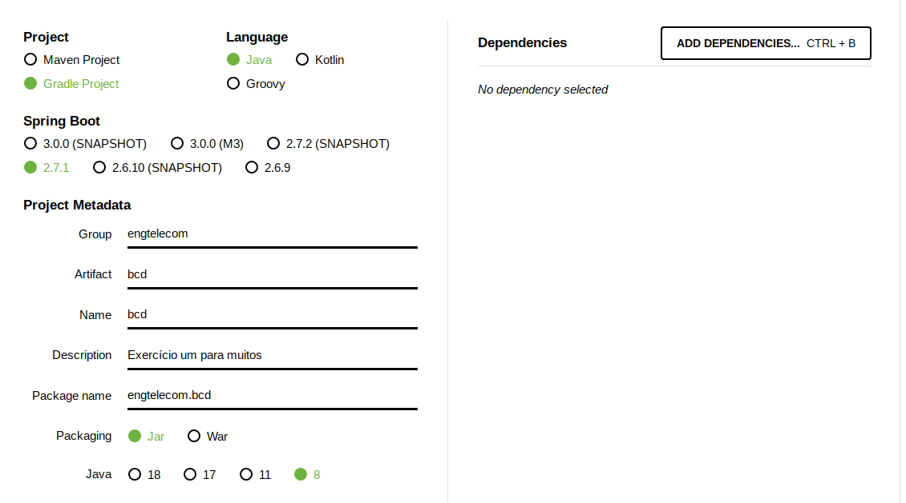
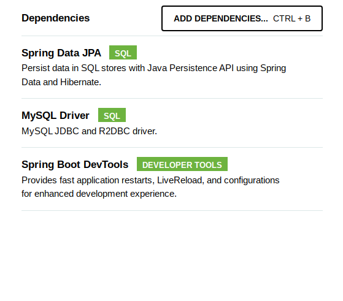

# Tutorial Springboot

* Abrir [springboot](springboot.io).
* No menu Project, entrar em Project Initializer, um assistente de criaçãod e projeto.
* Preencher o menu da forma:



* Adicionar as dependências:



* Clicando em generate, o navegador faz o download de um zip. Esse zip está presente nesse diretório.

* O subdiretório BCD representa o projeto gerado pelo springboot.

## Lombok

* Entrar em [lombok](https://plugins.gradle.org/plugin/io.freefair.lombok).
* Em resumo, mandará colocar na sessão de plugins do build.gradle:

```
plugins {
  id "io.freefair.lombok" version "6.5.0.3"
}
```

* Adicionar no /src/main/resources/application.properties:

```
spring.datasource.url=jdbc:mysql://ampto.sj.ifsc.edu.br:330006/lab03guilherme
spring.datasource.username=guilherme
spring.datasource.password=bcd1234

# none
# update
# create
# create-drop
spring.datasource.driver-class-name=com.mysql.cj.jdbc.Driver
```

Neste ponto o projeto está pronto para começar a ser codado. O subdiretorio [Projet3](../Projeto3) tem o código até este ponto, pronto para ser construído. O subdiretório [Projeto2](Projeto2) continua desse ponto em um exemplo utilizando as ferramentas.

## Documentação

Procurar por ```spring data JPA```
Implementar to strings